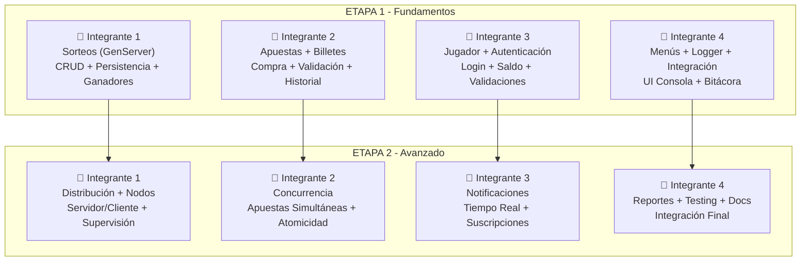

# 🎰 Plan de Implementación — Proyecto Azar S.A.

**Sistema de Gestión de Sorteos y Apuestas en Elixir**

---

## 📋 Contexto

El proyecto consiste en desarrollar una aplicación **distribuida en Elixir** que simula un sistema de lotería/sorteos con tres componentes:
- **Servidor Central** — nodo que centraliza sorteos, notificaciones y registros.
- **Cliente Administrador** — crea/cierra sorteos, consulta estados, genera reportes.
- **Cliente Jugador** — se registra, consulta sorteos, apuesta, ve historial.

### Estado actual del código

| Módulo | Estado | Descripción |
|---|---|---|
| `Azar.Jugador` | ✅ Funcional | Struct, CRUD, persistencia JSON, validación |
| `Azar.Sorteo` | ✅ Struct definido | Estructura de datos con campos completos |
| `Azar.SorteoServer` | 🔶 Parcial | GenServer básico: `start_link`, `init`, `consultar` |
| `Azar.Logger` | ✅ Funcional | Bitácora en pantalla + archivo `bitacora.txt` |
| `Azar.Util` | ✅ Funcional | Helpers de I/O, parsing, factoriales |
| `Estructura` | 🔶 Parcial | Solo flujo de registro de jugadores |
| `Azar.Admin` | ❌ Vacío | Sin implementar |
| `Admin` (lib/) | ❌ Vacío | Sin implementar |

---

## 🗓️ ETAPA 1 — Fundamentos del Sistema (Semana 1-2)

> **Objetivo:** Tener la lógica de negocio completa, persistencia JSON robusta, y las interfaces de consola (menús) funcionales para Administrador y Jugador de forma local (sin distribución aún).

---

### 👤 Integrante 1 — Módulo de Sorteos (Backend Core)

**Archivos:** `lib/azar/sorteo.ex`, `lib/azar/sorteo_server.ex`

#### Tareas:
- [ ] **Completar `Azar.SorteoServer`** con las siguientes operaciones via `GenServer.call/cast`:
  - `crear_sorteo/1` — Recibe datos y crea un nuevo sorteo con ID único
  - `listar_sorteos/0` — Devuelve todos los sorteos activos
  - `filtrar_sorteos/1` — Filtra por fecha o estado (`:pendiente`, `:realizado`, `:cancelado`)
  - `consultar_sorteo/1` — Detalle de un sorteo (jugadores inscritos, valor total apostado)
  - `cerrar_sorteo/1` — Cambia estado a `:realizado` y genera ganadores aleatorios
  - `cancelar_sorteo/1` — Cambia estado a `:cancelado`
- [ ] **Persistencia JSON** — Guardar/cargar sorteos desde `sorteos/` (ya tiene base, completar CRUD)
- [ ] **Generación de ganadores** — Algoritmo aleatorio para seleccionar números ganadores al cerrar un sorteo
- [ ] **Gestión de premios** — Estructura para definir premios (1er lugar, 2do, 3ro, etc.) con montos

#### Entregable:
> Un `SorteoServer` que se pueda iniciar, crear sorteos, consultarlos, cerrarlos con ganadores, y que persista todo en JSON.

---

### 👤 Integrante 2 — Módulo de Apuestas y Billetes

**Archivos:** `lib/azar/apuesta.ex` [NUEVO], `lib/azar/billete.ex` [NUEVO]

#### Tareas:
- [ ] **Crear struct `Azar.Apuesta`**:
  ```elixir
  defstruct [:id, :jugador_id, :sorteo_id, :numero_billete, :fracciones, :monto, :fecha]
  ```
- [ ] **Crear struct `Azar.Billete`**:
  ```elixir
  defstruct [:numero, :sorteo_id, :fracciones_disponibles, :fracciones_vendidas, :compradores]
  ```
- [ ] **Lógica de compra de billetes/fracciones:**
  - Validar que el sorteo esté en estado `:pendiente`
  - Validar que el billete/fracción esté disponible
  - Registrar la compra asociando jugador → billete → sorteo
  - Calcular monto según fracciones compradas
- [ ] **Persistencia JSON** — `apuestas.json` para registrar todas las apuestas
- [ ] **Historial de apuestas por jugador** — función para consultar apuestas de un jugador específico
- [ ] **Verificación de premios** — Función que dado un sorteo cerrado, determine si un jugador ganó

#### Entregable:
> Módulos `Apuesta` y `Billete` completos con CRUD, validaciones y persistencia JSON.

---

### 👤 Integrante 3 — Módulo de Jugador (Completar) + Autenticación

**Archivos:** `lib/azar/jugador.ex` [MODIFICAR], `lib/azar/autenticacion.ex` [NUEVO]

#### Tareas:
- [ ] **Mejorar `Azar.Jugador`**:
  - Agregar campo `saldo` al struct para controlar dinero disponible
  - Agregar campo `premios_ganados` (lista de premios obtenidos)
  - Función `actualizar_saldo/2` — sumar/restar saldo
  - Función `agregar_premio/2` — registrar un premio ganado
- [ ] **Crear módulo `Azar.Autenticacion`**:
  - `registrar/4` — Registra un nuevo jugador validando que no exista (por identificación)
  - `iniciar_sesion/2` — Valida identificación + contraseña contra el JSON
  - `validar_tarjeta/1` — Validación básica del número de tarjeta de crédito
- [ ] **Validaciones robustas:**
  - No permitir campos vacíos
  - No permitir identificaciones duplicadas
  - Contraseña mínima de 4 caracteres
- [ ] **Mejorar persistencia** — Actualizar `jugadores.json` al modificar datos de un jugador (no solo al crear)

#### Entregable:
> Sistema de autenticación funcional + jugador con saldo y premios, todo persistido en JSON.

---

### 👤 Integrante 4 — Menús de Consola + Logger + Estructura Principal

**Archivos:** `lib/azar/admin.ex`, `lib/estructura.ex` [MODIFICAR], `lib/azar/logger.ex` [MODIFICAR]

#### Tareas:
- [ ] **Menú principal** (`Estructura`):
  ```
  ═══════════════════════════════
      AZAR S.A. - Sorteos
  ═══════════════════════════════
  1. Ingresar como Administrador
  2. Ingresar como Jugador
  3. Salir
  ═══════════════════════════════
  ```
- [ ] **Menú Administrador** (`Azar.Admin`):
  ```
  1. Crear nuevo sorteo
  2. Listar sorteos
  3. Filtrar sorteos (por fecha/estado)
  4. Consultar estado de sorteo
  5. Cerrar sorteo (generar ganadores)
  6. Generar reportes
  7. Volver al menú principal
  ```
- [ ] **Menú Jugador** (nuevo módulo o en `Estructura`):
  ```
  1. Registrarse
  2. Iniciar sesión
  --- (después de iniciar sesión) ---
  3. Ver sorteos disponibles
  4. Comprar billete/fracción
  5. Ver mi historial de apuestas
  6. Ver mis premios ganados
  7. Cerrar sesión
  ```
- [ ] **Mejorar Logger:**
  - Agregar nivel de log (`:info`, `:warning`, `:error`)
  - Formato más completo: `[NIVEL] FECHA HORA - Módulo - Solicitud - Resultado`
- [ ] **Integrar todos los módulos** — Conectar las llamadas de los menús con los módulos de Integrante 1, 2 y 3

#### Entregable:
> Aplicación ejecutable con menús funcionales que conecten todas las funcionalidades de los demás integrantes.

---

## 🗓️ ETAPA 2 — Distribución, Concurrencia y Funcionalidades Avanzadas (Semana 3-4)

> **Objetivo:** Convertir el sistema local en un sistema **distribuido** con nodos Elixir, manejar concurrencia correctamente, implementar notificaciones, reportes avanzados e integración final.

---

### 👤 Integrante 1 — Distribución y Nodos Elixir

**Archivos:** `lib/azar/servidor.ex` [NUEVO], `lib/azar/cliente.ex` [NUEVO], modificar `sorteo_server.ex`

#### Tareas:
- [ ] **Configurar nodos distribuidos:**
  - Nodo servidor: `servidor@hostname`
  - Nodo(s) cliente: `cliente1@hostname`, `cliente2@hostname`
  - Conexión entre nodos con `Node.connect/1`
- [ ] **Migrar SorteoServer a nodo servidor** — El GenServer debe correr en el nodo central
- [ ] **Crear módulo `Azar.Servidor`:**
  - Arrancar el nodo servidor con todos los GenServers
  - Registrar procesos globalmente con `:global`
  - Manejar la reconexión si un cliente se desconecta
- [ ] **Crear módulo `Azar.Cliente`:**
  - Conectarse al servidor
  - Enviar solicitudes remotas (`GenServer.call({:global, id}, msg)`)
  - Manejar timeouts y errores de conexión
- [ ] **Supervisión** — Implementar un `Supervisor` para reiniciar `SorteoServer` si falla

#### Entregable:
> Sistema funcionando con al menos 2 nodos (servidor + 1 cliente) comunicándose correctamente.

---

### 👤 Integrante 2 — Concurrencia y Manejo de Apuestas Simultáneas

**Archivos:** `lib/azar/apuesta.ex` [MODIFICAR], `lib/azar/sorteo_server.ex` [MODIFICAR]

#### Tareas:
- [ ] **Manejo de concurrencia en apuestas:**
  - Usar el GenServer como punto de serialización para evitar race conditions
  - Implementar `handle_call` para compra de fracciones con validación atómica
  - Garantizar que dos jugadores no compren la misma fracción simultáneamente
- [ ] **Testing de concurrencia:**
  - Crear script de prueba que lance múltiples procesos comprando al mismo tiempo
  - Verificar que no haya sobreventa de fracciones
- [ ] **Transacciones atómicas:**
  - Asegurar que si falla la compra, no quede en estado inconsistente
  - Rollback si el pago falla pero la fracción fue reservada
- [ ] **Cola de espera** (opcional pero valioso):
  - Si un sorteo está siendo procesado, encolar la solicitud

#### Entregable:
> Sistema que maneja correctamente múltiples apuestas simultáneas sin inconsistencias.

---

### 👤 Integrante 3 — Notificaciones y Comunicación en Tiempo Real

**Archivos:** `lib/azar/notificador.ex` [NUEVO], `lib/azar/suscripcion.ex` [NUEVO]

#### Tareas:
- [ ] **Crear módulo `Azar.Notificador`** (GenServer o Agent):
  - Mantener registro de jugadores suscritos a notificaciones
  - Enviar notificaciones cuando se crea un nuevo sorteo
  - Enviar notificaciones cuando se cierra un sorteo (resultados)
  - Enviar notificación personal si un jugador ganó un premio
- [ ] **Sistema de suscripción:**
  - Al registrarse, el jugador se suscribe automáticamente
  - Opción de desuscribirse de notificaciones
- [ ] **Notificaciones distribuidas:**
  - Enviar mensajes entre nodos usando `send/2` o `GenServer.cast`
  - Las notificaciones deben llegar al nodo del cliente
- [ ] **Historial de notificaciones:**
  - Guardar notificaciones enviadas en JSON
  - El jugador puede consultar sus notificaciones pasadas

#### Entregable:
> Sistema de notificaciones funcional que avise a jugadores de eventos relevantes en tiempo real.

---

### 👤 Integrante 4 — Reportes, Integración Final y Testing

**Archivos:** `lib/azar/reportes.ex` [NUEVO], modificar menús, `test/`

#### Tareas:
- [ ] **Crear módulo `Azar.Reportes`:**
  - Reporte de ventas por sorteo (total recaudado, billetes vendidos)
  - Reporte de premios entregados (quién ganó qué y cuánto)
  - Reporte general del sistema (sorteos realizados, dinero movido, jugadores activos)
  - Formato legible en consola (tablas con bordes)
- [ ] **Integración final de todos los módulos:**
  - Actualizar menús para incluir funcionalidades de distribución
  - Agregar opción de conectarse como cliente remoto
  - Manejar errores de conexión gracefully en la UI
- [ ] **Testing:**
  - Tests unitarios para módulos críticos (`Sorteo`, `Apuesta`, `Jugador`)
  - Test de integración: flujo completo de crear sorteo → apostar → cerrar → verificar ganador
  - Test de distribución: verificar comunicación entre nodos
- [ ] **Documentación:**
  - README completo con instrucciones de ejecución
  - Documentar cómo levantar nodos distribuidos
  - `@moduledoc` y `@doc` en todos los módulos públicos

#### Entregable:
> Reportes funcionales, sistema integrado y probado, documentación completa.

---

## 📊 Resumen Visual de Responsabilidades



---

## 📁 Estructura de Archivos Final Esperada

```
lib/
├── azar/
│   ├── jugador.ex          # Struct + CRUD jugadores (Integrante 3)
│   ├── autenticacion.ex    # Login/Registro (Integrante 3) [NUEVO]
│   ├── sorteo.ex           # Struct sorteo (Integrante 1)
│   ├── sorteo_server.ex    # GenServer sorteos (Integrante 1)
│   ├── apuesta.ex          # Struct + lógica apuestas (Integrante 2) [NUEVO]
│   ├── billete.ex          # Struct + lógica billetes (Integrante 2) [NUEVO]
│   ├── servidor.ex         # Nodo servidor distribuido (Integrante 1) [NUEVO]
│   ├── cliente.ex          # Nodo cliente distribuido (Integrante 1) [NUEVO]
│   ├── notificador.ex      # Notificaciones (Integrante 3) [NUEVO]
│   ├── suscripcion.ex      # Suscripciones (Integrante 3) [NUEVO]
│   ├── reportes.ex         # Reportes (Integrante 4) [NUEVO]
│   ├── logger.ex           # Bitácora mejorada (Integrante 4)
│   ├── admin.ex            # Menú admin (Integrante 4)
│   └── proyecto_azar.ex    # Módulo raíz
├── estructura.ex           # Menú principal (Integrante 4)
└── util.ex                 # Utilidades compartidas (todos)
sorteos/                    # JSONs de sorteos
jugadores.json              # Datos de jugadores
apuestas.json               # Datos de apuestas [NUEVO]
notificaciones.json         # Historial notificaciones [NUEVO]
test/
└── ...                     # Tests (Integrante 4 - Etapa 2)
```

---

## ⚠️ Dependencias entre integrantes

> [!IMPORTANT]
> Los integrantes deben coordinarse en estos puntos clave para evitar conflictos:

| Dependencia | Detalle |
|---|---|
| **Int. 4 depende de todos** | Los menús llaman funciones de todos los módulos. Int. 4 debe definir interfaces temprano y los demás deben respetarlas. |
| **Int. 2 depende de Int. 1** | Las apuestas necesitan sorteos existentes. Int. 1 debe tener `crear_sorteo` listo primero. |
| **Int. 2 depende de Int. 3** | Las apuestas necesitan jugadores autenticados. Int. 3 debe tener login listo temprano. |
| **Todos dependen de `Util`** | Usar `Azar.Util` para I/O. Si alguien necesita una función nueva, agregarla ahí. |

> [!TIP]
> **Recomendación:** Al inicio de la Etapa 1, hagan una reunión para acordar los **nombres de funciones públicas** de cada módulo. Así Int. 4 puede empezar los menús con stubs mientras los demás implementan la lógica.

---

## ✅ Criterio de Verificación

### Etapa 1
- [ ] Se pueden registrar jugadores y se guardan en JSON
- [ ] Se puede iniciar sesión con credenciales válidas
- [ ] Se pueden crear sorteos con premios desde el menú admin
- [ ] Se pueden listar/filtrar sorteos
- [ ] Se pueden comprar billetes/fracciones
- [ ] Se puede cerrar un sorteo y generar ganadores
- [ ] La bitácora registra todas las operaciones
- [ ] Todos los datos persisten al reiniciar la app

### Etapa 2
- [ ] La app funciona con nodos distribuidos (servidor + cliente)
- [ ] Múltiples jugadores pueden apostar al mismo tiempo sin errores
- [ ] Los jugadores reciben notificaciones de sorteos y resultados
- [ ] Se generan reportes de ventas y premios
- [ ] Tests unitarios pasan correctamente
- [ ] Documentación completa
